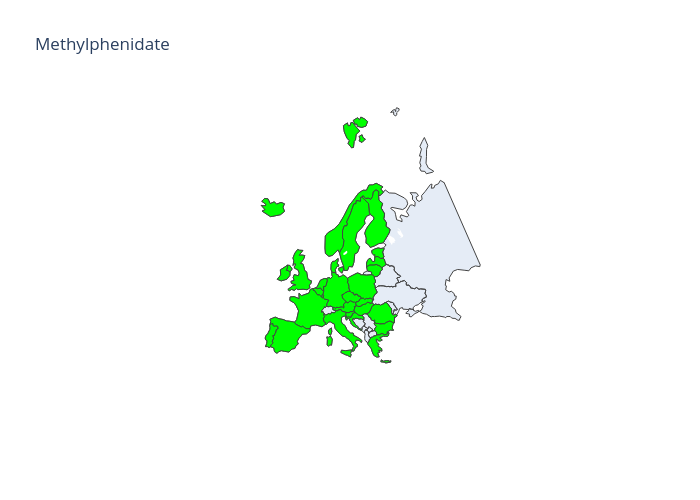

# ADHD European Drug Map

## What is this?
This is a script to automatically download the latest list of drug medications from the EMA (European Medicine Agency), and plot the drug availability per country. The focus of this script is ADHD medication, as it varies wildly by country. Specifically, the drugs tracked are `Methylphenidate`, `Lisdexamfetamine`, `Dexamfetamine`, `Atomoxetine`, `Guanfacine` and `Clonidine`. Note that only countries handled by the EMA are updated, for example Switzerland is in Europe but not part of the European Union. Originally, this project was suggested by a friend after taking a look at [this much cleaner but somewhat outdated ADHD map](https://www.reddit.com/r/europe/comments/mdo3mv/a_map_i_made_of_adhd_treatment_options_in_europe/).

## Results as of september 2024





## Usage

Python version: `3.11`

### With pip

Install dependencies:
```shell
pip install -r requirements.txt
```

Run:
```shell
python adhd_drug_map.py
```

See available arguments:
```shell
python adhd_drug_map.py --help
```

### With [Poetry](https://python-poetry.org/docs/#installation)

Install dependencies:
```shell
poetry install
```

Run:
```shell
poetry run python adhd_drug_map.py
```

See available arguments:
```shell
poetry run python adhd_drug_map.py --help
```

## TODO
- Find a way to show all the medication availability in the same plot. This would likely require either using extensive hachure and figures, or figuring out if the combination of cases are small enough to fit in a legend.
- use shape patterns and shit: https://plotly.com/python/pattern-hatching-texture/ to make a single map with all the information
